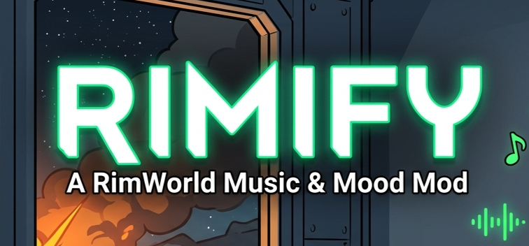

# Rimify 🎵

**Modern in-game dark-themed music player, rotation manager & YouTube sync for RimWorld**  
*Современный тёмный аудиоплеер, менеджер ротации и YouTube-загрузчик для RimWorld*

 

 

**[ English ](#-english) | [ Русский ](#-русский)**

---

# 🌐 English

## 📖 About The Project

**Rimify** is a complete audio quality-of-life overhaul for RimWorld. It centralizes vanilla ambient soundtracks, official DLC OSTs, third-party music mods, and external downloads into a sleek, unified desktop-class media player.

Take absolute control over what plays, when it plays, and how your colony experiences its triumphs and disasters.

---

## ✨ Key Features

### 🎛️ Minimalist HUD Widget
* **Seamless Window Dragging:** Grab and drag the widget anywhere on your screen. Coordinates are automatically saved.
* **Marquee Text Display:** Smoothly scrolls titles that exceed screen boundaries with natural pauses at each edge.
* **Scrubbing & Timers:** Clickable progress bar for seeking through the song alongside crystal-clear timestamp readouts.
* **Live Download Progress:** Subtle bottom progress bar and percentage tracker display whenever audio is downloading in the background.

### 📌 PlaySettings Integration
* Adds an authentic toggle button directly into RimWorld's bottom-right game control panel (`PlaySettings`).
* **Left-Click:** Instantly show or hide the floating HUD player.
* **Right-Click:** Jump straight into the full Music Manager window.

### 🔀 Playback Modes
* **Shuffle vs. Sequential (🔀 / ⇉):** Choose between true randomized music selection or strict alphabetical/playlist sequence.
* **Repeat Mode (🔂 / 🔁):** Loop a single battle theme for intense raids or cycle through the entire library.
* **Continuous Mode vs. Atmospheric Silence (∞ / ⏳):** Toggle between uninterrupted non-stop playback or customizable atmospheric silence intervals (5–360 seconds).

### ⌨️ Native Hotkeys
* Configurable directly in RimWorld's **Options → Keyboard Configuration → Rimify**:
  * **Play / Pause** (Default: `` ` `` / BackQuote)
  * **Next Track** (Default: `]`)
  * **Previous / Restart Track** (Default: `[`)

### 📚 Centralized Media Library
* Automatically scans Core, Royalty, Ideology, Biotech, Anomaly, and active third-party music packs.
* Fast category filtering (Core, Mods, Custom, Peaceful, Combat, Disabled) and sub-millisecond search bar.
* Integrated volume slider (`Prefs.VolumeMusic`) in the window footer.

### 🏷️ Interactive Rotation Tags
* **Combat vs. Peaceful:** Force-assign tracks to frantic firefights or calm everyday colony life.
* **Circadian Rhythm:** Bind playback specifically to Day, Night, or Any time.
* **Rotation Mute:** Silence tracks from the automatic queue without deleting them from disk.

### 📁 Custom Playlists
* Create unlimited user-defined playlists.
* Add or remove songs quickly via right-click context menu.
* **"Play only this playlist" Mode:** Lock playback strictly to a selected playlist for events, rituals, or building projects.

### 📥 YouTube & YouTube Music Sync
* Supports individual video links, music links, or full albums/playlists.
* Non-blocking background download via `yt-dlp` and `ffmpeg` with zero frame drops.
* **One-Click Core Updater:** Dedicated `[ UPD ]` tool button directly downloads the latest `yt-dlp.exe` binary from GitHub.

### ⚡ Extreme Performance & Zero RAM Bloat
* **Audio Streaming (`streamAudio = true`):** Tracks stream on-demand from storage, reducing RAM consumption from ~3.5GB to under 2MB for 95+ songs.
* **List Virtualization (Culling):** Only visible rows are rendered, guaranteeing 144–165+ FPS across extensive collections.

---

## 📂 Storage Paths

Configuration and audio files are stored in the user profile directory:
* **Track Library:** `%USERPROFILE%/AppData/LocalLow/Ludeon Studios/RimWorld by Ludeon Studios/Rimify/Tracks/`
* **Configuration:** `%USERPROFILE%/AppData/LocalLow/Ludeon Studios/RimWorld by Ludeon Studios/Rimify/config.xml`
* **Tools (`yt-dlp` & `ffmpeg`):** `%USERPROFILE%/AppData/LocalLow/Ludeon Studios/RimWorld by Ludeon Studios/Rimify/Tools/`

---

## 📦 Manual Installation (DRM-Free / GOG)

1. Download the latest release from the [GitHub Releases](https://github.com/xLiRx/Rimify/releases) page.
2. Unpack the contents directly into your RimWorld mod directory: RimWorld/Mods/Rimify
3. Enable Rimify in the in-game mod list.

# 🌐 Русский

## 📖 О проекте

**Rimify** — это полноценное переосмысление музыкальной системы RimWorld. Мод объединяет стандартные треки игры, официальные дополнения (OST DLC), сторонние музыкальные паки и внешние загрузки в едином плеере с тёмным интерфейсом в стиле современных десктопных приложений.

Возьмите полный контроль над тем, что и когда играет в вашей колонии — от напряженных рейдов до мирного строительства.

---

## ✨ Ключевые возможности

### 🎛️ Минималистичный HUD-виджет
* **Свободное перемещение:** плеер плавно перетаскивается зажатием мыши в любую точку экрана. Координаты сохраняются автоматически.
* **Бегущая строка (Marquee):** длинные названия плавно прокручиваются с комфортными паузами по краям.
* **Шкала прогресса и таймеры:** кликабельная полоса воспроизведения для перемотки и чёткое отображение времени.
* **Панель загрузки:** компактный нижний тулбар с процентами и названием скачиваемого трека во время фоновой загрузки.

### 📌 Интеграция в PlaySettings
* Гармоничная кнопка-тумблер в правом нижнем углу экрана рядом с ванильными переключателями:
* **ЛКМ по ноте:** скрыть или показать плавающий HUD-плеер.
* **ПКМ по ноте:** мгновенно открыть окно медиатеки.

### 🔀 Режимы воспроизведения
* **Shuffle / По порядку (🔀 / ⇉):** выбор между случайной ротацией треков и воспроизведением строго по очереди.
* **Repeat / Повтор (🔂 / 🔁):** зацикливание одного трека для эпичных боев или цикличный повтор фонотеки.
* **Continuous / Атмосферная тишина (∞ / ⏳):** режим непрерывной музыки либо настраиваемые интервалы пауз тишины (от 5 до 360 сек).

### ⌨️ Системные горячие клавиши
* Настраиваются прямо в меню **Настройки → Управление → Rimify**:
  * **Воспроизведение / Пауза** (По умолчанию: `` ` `` / Ё)
  * **Следующий трек** (По умолчанию: `]`)
  * **Предыдущий / С начала** (По умолчанию: `[`)

### 📚 Единая медиатека
* Автоматическое сканирование Core, Royalty, Ideology, Biotech, Anomaly и сторонних модов на музыку.
* Фильтры по категориям и мгновенный поиск без задержек.
* Встроенный регулятор громкости музыки (`Prefs.VolumeMusic`) прямо в футере окна плеера.

### 🏷️ Интерактивные теги ротации
* **Бой / Мир:** принудительное назначение треков на перестрелки или спокойный быт.
* **Время суток:** привязка трека ко Дню, Ночи или Любому часу.
* **Исключение из ротации:** отключение надоевшей композиции без физического удаления с диска.

### 📁 Кастомные плейлисты
* Создание неограниченного числа пользовательских плейлистов.
* Добавление и удаление треков через контекстное меню (ПКМ).
* Режим **«Играть только этот плейлист»** для фиксации атмосферы под конкретную задачу.

### 📥 Синхронизация с YouTube
* Скачивание отдельных треков, альбомов и плейлистов из YouTube и YouTube Music.
* Фоновое скачивание и конвертация через `yt-dlp` и `ffmpeg` без зависаний игры.
* **Обновление утилиты в один клик:** кнопка `[ UPD ]` загружает свежее ядро `yt-dlp.exe` напрямую с официального GitHub.

### ⚡ Высокая оптимизация и чистая память
* **Стриминг аудио (`streamAudio = true`):** треки считываются с диска потоком, удерживая потребление RAM в пределах 2 МБ вместо 3.5 ГБ даже при сотне скачанных песен.
* **Виртуализация строк:** рендерятся только видимые на экране треки, что гарантирует стабильные 144–165+ FPS.

---

## 📂 Пути хранения данных

Все пользовательские треки и настройки хранятся в системной папке профиля:
* **Фонотека:** `%USERPROFILE%/AppData/LocalLow/Ludeon Studios/RimWorld by Ludeon Studios/Rimify/Tracks/`
* **Конфигурация:** `%USERPROFILE%/AppData/LocalLow/Ludeon Studios/RimWorld by Ludeon Studios/Rimify/config.xml`
* **Инструменты (`yt-dlp`, `ffmpeg`):** `%USERPROFILE%/AppData/LocalLow/Ludeon Studios/RimWorld by Ludeon Studios/Rimify/Tools/`

---

## 📦 Ручная установка (DRM-Free / GOG)

1. Перейдите на вкладку [GitHub Releases](https://github.com/xLiRx/Rimify/releases).
2. Скачайте архив последней версии `Rimify-vX.X.X.zip`.
3. Распакуйте папку `Rimify` в каталог модов игры: RimWorld/Mods/Rimify
   
4. Активируйте **Rimify** в списке модов игры.